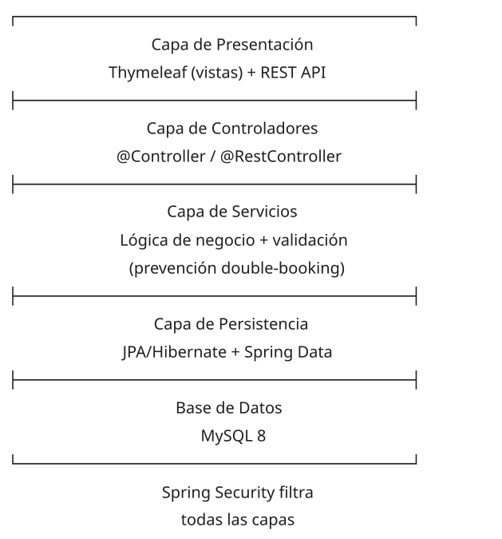
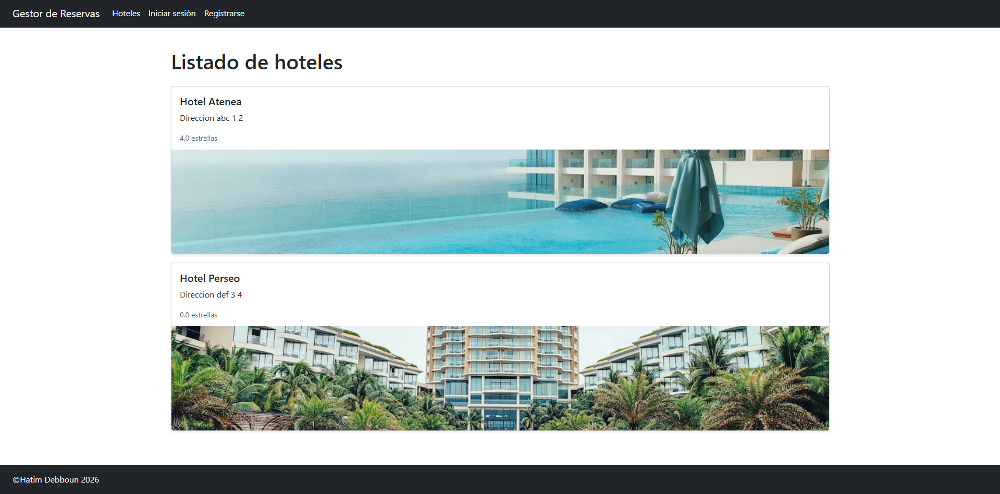
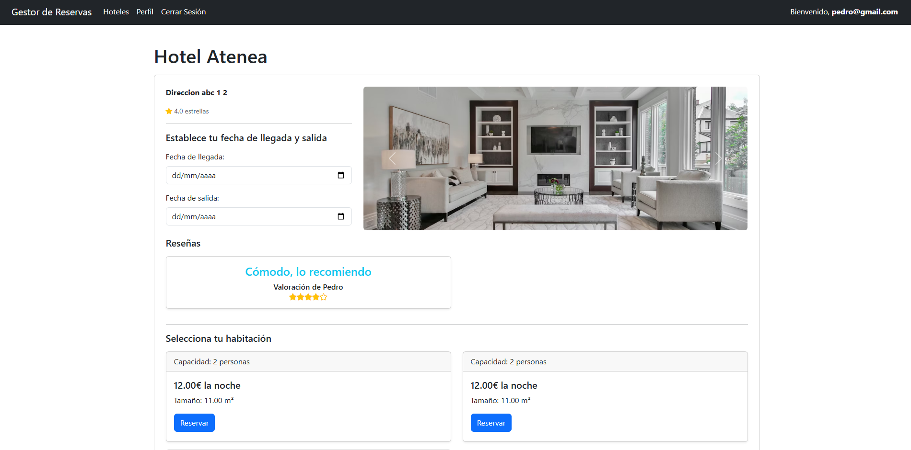
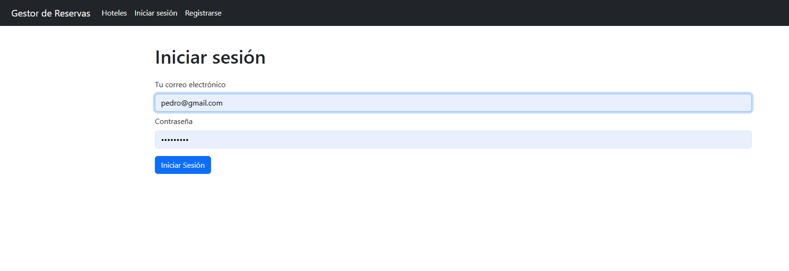
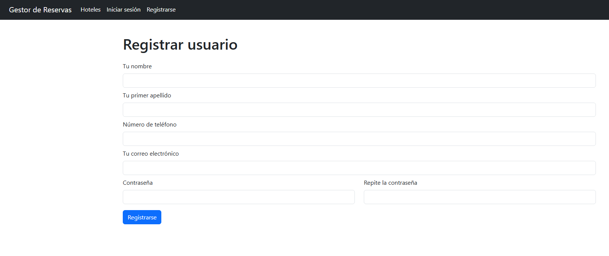
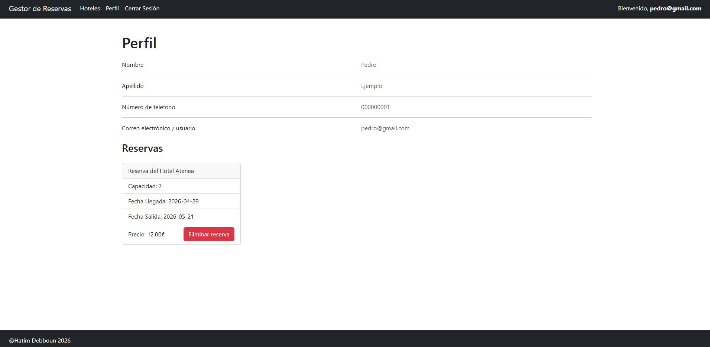
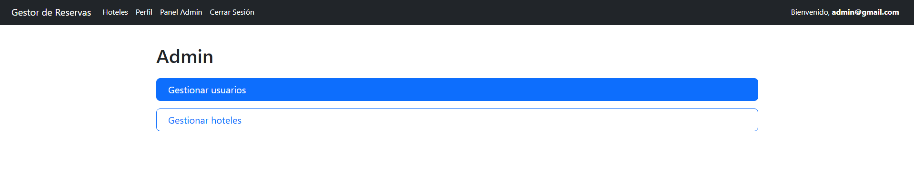
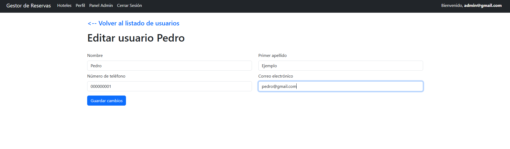
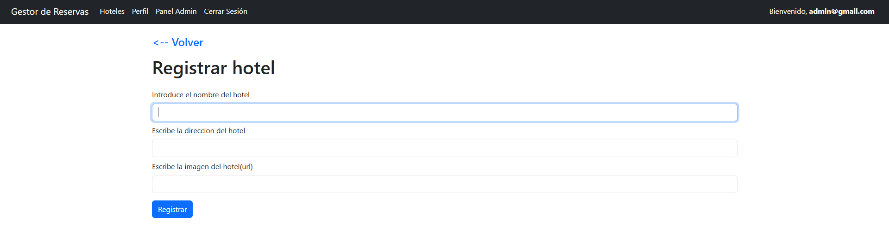

# Sistema de Gestión de Reservas Hoteleras

[](https://openjdk.org/projects/jdk/21/)
[](https://spring.io/projects/spring-boot)
[](https://spring.io/projects/spring-security)
[](https://www.mysql.com/)
[](https://www.thymeleaf.org/)
[](https://hatimdebboun.dev)

API REST y aplicación web backend para la gestión integral de hoteles y reservas. Desarrollada con **Java 21**, **Spring Boot 4.0.3** y **Spring Security**, implementa autenticación basada en roles, prevención de reservas duplicadas y una arquitectura limpia orientada a la mantenibilidad y escalabilidad.

---

## Arquitectura



El proyecto sigue una arquitectura MVC en capas con separación clara de responsabilidades:

**Modelo de datos principal:**
- `Usuario`: autenticación y perfil (`ROLE_USER` / `ROLE_ADMIN`)
- `Persona`: datos personales asociados 1:1 a un `Usuario`
- `Hotel`: entidad principal con habitaciones y valoraciones
- `Habitacion`: pertenece a un hotel, con capacidad, precio y tamaño
- `Reserva`: relación `@ManyToOne` con `Persona` y `Habitacion`
- `Valoracion`: reseñas de hoteles hechas por personas

---

## Stack

| Capa          | Tecnología                                  |
|---------------|----------------------------------------------|
| Backend       | Java 21 · Spring Boot 4.0.3                  |
| Seguridad     | Spring Security 6 · BCrypt                   |
| Persistencia  | Spring Data JPA + Hibernate                  |
| API REST      | Spring Data REST                             |
| Vistas        | Thymeleaf + thymeleaf-extras-springsecurity6 |
| Validación    | Spring Validation (Bean Validation)          |
| Base de datos | MySQL 8                                      |
| Build         | Maven · Lombok                               |

---

## Funcionalidades

**Usuario registrado:**
- Registro y autenticación con contraseña cifrada (BCrypt)
- Búsqueda y visualización de hoteles disponibles
- Creación, consulta y cancelación de reservas propias
- Gestión de perfil personal

**Administrador:**
- Panel de administración con CRUD completo de hoteles
- Gestión de usuarios y roles
- Visualización de todas las reservas del sistema

**Sistema:**
- Algoritmo de prevención de double-booking y validación de solapamiento de fechas en la capa de servicio
- Protección CSRF activa en todos los formularios
- Bean Validation en todos los formularios de entrada
- DTOs para desacoplar la capa de persistencia de la vista
- Endpoints REST protegidos por rol para evitar escalada de privilegios

---

## Capturas de pantalla

| Pantalla | Vista |
|----------|-------|
| Índice |  |
| Vista de hoteles |  |
| Login |  |
| Registro |  |
| Perfil de usuario |  |
| Panel admin resumen |  |
| Panel admin usuarios |  |
| Panel admin hoteles |  |

---

## Decisiones de diseño

**¿Por qué DTOs?**
Se usan para separar el modelo de persistencia (`@Entity`) de lo que se expone en vistas y endpoints REST. Esto evita exponer campos sensibles (como `password`) y facilita evolucionar el modelo de datos sin romper las interfaces.

**¿Por qué la validación de double-booking está en la capa de servicio y no en la BD?**
Centralizar la lógica en el servicio permite reutilizarla desde el controlador MVC y desde los endpoints REST sin duplicar código. La validación consulta reservas solapadas con una query JPQL antes de persistir.

**¿Por qué Spring Data REST además de los controladores MVC?**
Permite exponer los repositorios directamente como endpoints REST HAL para consumo programático, mientras los controladores `@Controller` sirven las vistas Thymeleaf. Dos interfaces para dos tipos de cliente, ambas protegidas explícitamente por rol.

---

## Instalación y ejecución

**Requisitos:** Java 21, Maven 3.x, MySQL 8

### 1. Crear base de datos

```sql
CREATE DATABASE reservas;
CREATE USER 'usr_reservas'@'localhost' IDENTIFIED BY 'passwordreservas';
GRANT ALL PRIVILEGES ON reservas.* TO 'usr_reservas'@'localhost';
FLUSH PRIVILEGES;
```

### 2. Clonar y ejecutar

```bash
git clone https://github.com/DebHatim/reservasSpringBoot.git
cd reservasSpringBoot

# Windows
mvnw spring-boot:run

# Linux / macOS
chmod +x mvnw && ./mvnw spring-boot:run
```

La aplicación arranca en `http://localhost:8080`

---

## Seguridad

Configuración de Spring Security con separación de zonas pública, privada y de administración:

```java
@Configuration
@EnableWebSecurity
public class WebSecurityConfig {

    @Bean
    public PasswordEncoder passwordEncoder() {
        return new BCryptPasswordEncoder();
    }

    @Bean
    SecurityFilterChain securityFilterChain(HttpSecurity http) throws Exception {
        http.authorizeHttpRequests(auth -> auth
                        .requestMatchers("/", "/signin/**", "/login**", "/hotel/**",
                                "/perfil/**", "/css/**", "/js/**", "/favicon.ico").permitAll()
                        .requestMatchers("/admin/**").hasRole("ADMIN")
                        .requestMatchers("/usuarios/**", "/personas/**", "/reservas/**",
                                "/habitaciones/**", "/valoraciones/**", "/hoteles/**").hasRole("ADMIN")
                        .anyRequest().authenticated())
                .formLogin(form -> form
                        .loginPage("/login")
                        .loginProcessingUrl("/login")
                        .defaultSuccessUrl("/", true)
                        .permitAll())
                .logout(logout -> logout.logoutSuccessUrl("/").permitAll());
        return http.build();
    }
}
```

- Zona pública: índice, hoteles, login, registro, assets estáticos
- Zona privada: reservas, perfil (autenticación requerida)
- Zona admin: panel de administración y endpoints REST de Spring Data REST, restringidos a `ROLE_ADMIN`
- Contraseñas cifradas con `BCryptPasswordEncoder`
- Protección CSRF activa por defecto

---

## Autor

**Hatim Debboun** · [Portfolio](https://hatimdebboun.dev) · [LinkedIn](https://linkedin.com/in/hatimdebboun) · [GitHub](https://github.com/DebHatim)